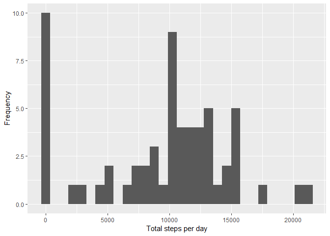
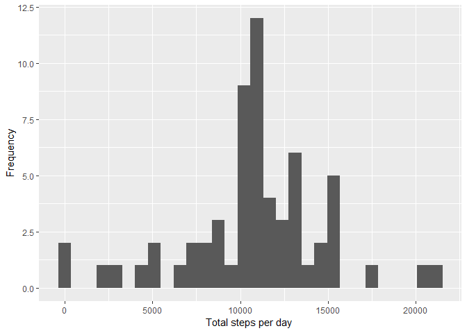

## Loading and preprocessing the data
1.Load the data

```r
library(ggplot2)
```

```
## Warning: package 'ggplot2' was built under R version 3.5.1
```

```r
activity_data <- read.csv("activity.csv")
summary(activity_data)
```

```
##      steps                date          interval     
##  Min.   :  0.00   2012-10-01:  288   Min.   :   0.0  
##  1st Qu.:  0.00   2012-10-02:  288   1st Qu.: 588.8  
##  Median :  0.00   2012-10-03:  288   Median :1177.5  
##  Mean   : 37.38   2012-10-04:  288   Mean   :1177.5  
##  3rd Qu.: 12.00   2012-10-05:  288   3rd Qu.:1766.2  
##  Max.   :806.00   2012-10-06:  288   Max.   :2355.0  
##  NA's   :2304     (Other)   :15840
```


## What is mean total number of steps taken per day?
1. Make a histogram of the total number of steps taken each day

```r
stepsByDay <- tapply(activity_data$steps, activity_data$date, sum, na.rm=TRUE)
qplot(stepsByDay, xlab='Total steps per day', ylab='Frequency')
```

```
## `stat_bin()` using `bins = 30`. Pick better value with `binwidth`.
```

<!-- -->
2. Calculate and report the mean and median total number of steps taken per day


```r
stepsByDayMean <- mean(stepsByDay)
stepsByDayMedian <- median(stepsByDay)
print(stepsByDayMean)
```

```
## [1] 9354.23
```

```r
print(stepsByDayMedian)
```

```
## [1] 10395
```
## What is the average daily activity pattern?

```r
averageStepsPerTimeBlock <- aggregate(x=list(meanSteps=activity_data$steps), by=list(interval=activity_data$interval), FUN=mean, na.rm=TRUE)
```

1. Make a time series plot

```r
ggplot(data=averageStepsPerTimeBlock, aes(x=interval, y=meanSteps)) +
    geom_line() +
    xlab("5-minute interval") +
    ylab("average number of steps taken") 
```

<!-- -->
2. Which 5-minute interval, on average across all the days in the dataset, contains the maximum number of steps?

```r
mostSteps <- which.max(averageStepsPerTimeBlock$meanSteps)
timeMostSteps <-  gsub("([0-9]{1,2})([0-9]{2})", "\\1:\\2", averageStepsPerTimeBlock[mostSteps,'interval'])
print(timeMostSteps)
```

```
## [1] "8:35"
```
## Imputing missing values
1. Calculate and report the total number of missing values in the dataset

```r
numMissingValues <- length(which(is.na(activity_data$steps)))
print(numMissingValues)
```

```
## [1] 2304
```
2. Devise a strategy for filling in all of the missing values in the dataset.

```r
library(Hmisc)
```

```
## Warning: package 'Hmisc' was built under R version 3.5.1
```

```
## Loading required package: lattice
```

```
## Warning: package 'lattice' was built under R version 3.5.1
```

```
## Loading required package: survival
```

```
## Warning: package 'survival' was built under R version 3.5.1
```

```
## Loading required package: Formula
```

```
## 
## Attaching package: 'Hmisc'
```

```
## The following objects are masked from 'package:base':
## 
##     format.pval, units
```

```r
activityDataImputed <- activity_data
activityDataImputed$steps <- impute(activity_data$steps, fun=mean)
stepsByDayImputed <- tapply(activityDataImputed$steps, activityDataImputed$date, sum)
qplot(stepsByDayImputed, xlab='Total steps per day ', ylab='Frequency')
```

```
## `stat_bin()` using `bins = 30`. Pick better value with `binwidth`.
```

<!-- -->

```r
stepsByDayMeanImputed <- mean(stepsByDayImputed)
stepsByDayMedianImputed <- median(stepsByDayImputed)
print(stepsByDayMeanImputed)
```

```
## [1] 10766.19
```

```r
print(stepsByDayMedianImputed)
```

```
## [1] 10766.19
```

## Are there differences in activity patterns between weekdays and weekends?
1. Create a new factor variable in the dataset with two levels - "weekday" and "weekend" indicating whether a given date is a weekday or weekend day.

```r
activityDataImputed$dateType <-  ifelse(as.POSIXlt(activityDataImputed$date)$wday %in% c(0,6), 'weekend', 'weekday')
```
2. Make a panel plot containing a time series plot

```r
averagedActivityDataImputed <- aggregate(steps ~ interval + dateType, data=activityDataImputed, mean)
ggplot(averagedActivityDataImputed, aes(interval, steps)) + 
    geom_line() + 
    facet_grid(dateType ~ .) +
    xlab("5-minute interval") + 
    ylab("avarage number of steps")
```

<!-- -->
